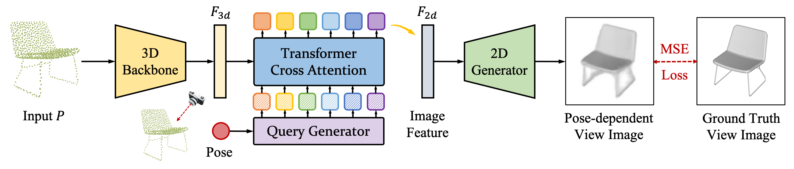

# Take-A-Photo: 3D-to-2D Generative Pre-training of Point Cloud Models

[](https://paperswithcode.com/sota/3d-point-cloud-classification-on-scanobjectnn?p=take-a-photo-3d-to-2d-generative-pre-training)
[](https://paperswithcode.com/sota/3d-part-segmentation-on-shapenet-part?p=take-a-photo-3d-to-2d-generative-pre-training)

Created by [Ziyi Wang*](https://wangzy22.github.io/), [Xumin Yu*](https://yuxumin.github.io/), [Yongming Rao](https://raoyongming.github.io/), [Jie Zhou](https://scholar.google.com/citations?user=6a79aPwAAAAJ&hl=en&authuser=1), [Jiwen Lu](https://scholar.google.com/citations?user=TN8uDQoAAAAJ&hl=zh-CN).


This repository is a pyTorch implementation of our ICCV 2023 paper **TAP** (short for *Take-A-Photo*).

TAP is a generative pre-training method for *any* point cloud models. Given point cloud features extracted from backbone models, we generate view images from different instructed poses and calculate pixel-wise loss on image pixels as the pre-training scheme. Our pre-training method shows superior results on ScanObjectNN classification and ShapeNetPart segmentation than other generative pre-training methods based on mask modeling.

[[arXiv](https://arxiv.org/abs/2307.14971)][[Project Page](https://tap.ivg-research.xyz)]




## Preparation

### Installation Prerequisites

- Python 3.7
- CUDA 11.3
- PyTorch 1.10.1
- torch_scatter
- open3d, einops, cv2
- timm 0.5.4

```
conda create -n tap python=3.7 numpy=1.20 numba
conda activate tap
conda install -y pytorch=1.10.1 torchvision cudatoolkit=11.3 -c pytorch -c nvidia
pip install torch-scatter -f https://data.pyg.org/whl/torch-1.10.1+cu113.html
pip install -r requirements_openpoints.txt
pip install open3d einops opencv-python
pip install timm==0.5.4

cd openpoints/cpp/pointnet2_batch
python setup.py install
cd ../pointops
python setup.py install
cd ../subsampling
python setup.py install
cd ../../..
```

### Data Preparation

#### ShapeNet Dataset
- Download the 12 views image dataset of ShapeNet from [here](http://maxwell.cs.umass.edu/mvcnn-data/shapenet55v1.tar). The images are rendered by [MVCNN](https://github.com/suhangpro/mvcnn).

- Download the point cloud dataset that is corresponding to the ShapeNet image dataset above from [here](https://drive.google.com/file/d/1AFFHfAzpeNygphBgMP7uljwmBu8gPQT2/view?usp=share_link)(Google) or [here](https://cloud.tsinghua.edu.cn/f/610fb0228eca4035bd83/?dl=1)(Tsinghua Cloud). The point clouds are sampled by us. 

- （Optional) Or you can download the 12 views image dataset with object mesh files of ShapeNet from [here](http://maxwell.cs.umass.edu/mvcnn-data/shapenet55v1png.tar). Then you can sample point clouds by yourself from `.off` files via `openpoints/dataset/sample_pc.py`.

#### ScanObjectNN Dataset
- Download the official ScanObjectNN dataset from [here](http://103.24.77.34/scanobjectnn).

#### ShapeNetPart Dataset
- Download the official ShapeNetPart dataset from [here](https://shapenet.cs.stanford.edu/media/shapenetcore_partanno_segmentation_benchmark_v0_normal.zip).


#### Data File Structure
    ```
    P2P/
    |-- data/
        |-- ShapeNet55/
            |-- poinyclouds
                |-- train/
                    |-- model_000003.ply
                    |-- ...
                |-- val/
                    |-- model_000009.ply
                    |-- ...
                |-- test/
                    |-- model_000001.ply
                    |-- ...
            |-- shapenet55v1/
                |-- train/
                    |-- model_000003_001.jpg
                    |-- ...
                |-- val/
                    |-- model_000009_001.jpg
                    |-- ...
                |-- test/
                    |-- model_000001_001.jpg
                    |-- ...
        |-- ScanObjectNN/
            |-- main_split/
                |-- training_objectdataset.h5
                |-- test_objectdataset.h5
                |-- training_objectdataset_augmentedrot_scale75.h5
                |-- test_objectdataset_augmentedrot_scale75.h5
            |-- main_split_nobg/
                |-- training_objectdataset.h5
                |-- test_objectdataset.h5
        ｜-- ShapeNetPart/
            |-- shapenetcore_partanno_segmentation_benchmark_v0_normal/
                |-- 02691156/
                    |-- 1a04e3eab45ca15dd86060f189eb133.txt
                    |-- ...
                |-- ...
                │── train_test_split/
                │── synsetoffset2category.txt

    ```

## Usage

### Pre-train on ShapeNet Dataset

```
python examples/classification/main.py --cfg cfgs/shapenet/BASEMODEL_pretrain.yaml
```

For example, to pre-train PointMLP model, just replace *BASEMODEL* with *pointmlp*:

```
python examples/classification/main.py --cfg cfgs/shapenet/pointmlp_pretrain.yaml
```

### Finetune on Downstream Tasks

First modify the *pretrained_path* in finetune configs. Then run following command:

```
python examples/classification/main.py --cfg cfgs/DATASET/BASEMODEL_finetune.yaml
```

For example, to finetune PointMLP model on ScanObjectNN Hardest dataset, just replace *DATASET* with *scanobjectnn* and replace *BASEMODEL* with *pointmlp*:

```
python examples/classification/main.py --cfg cfgs/scanobjectnn/pointmlp_finetune.yaml
```

## Results

### Quantitative Results

#### Classification on ScanObjectNN

| Point Model | TAP Pre-trained | OBJ_BG | OBJ_ONLY | PB_T50_RS |
| :---------: | :-------------: | :----: | :------: | :-------: |
| DGCNN       | [[Google](https://drive.google.com/file/d/1y82pONiNdA0T9OwFMJvshOc104qenEz4/view?usp=sharing) / [Tsinghua Cloud](https://cloud.tsinghua.edu.cn/f/13da92866ff64db0b4bc/?dl=1)] | -- | -- | 86.6 [[Google](https://drive.google.com/file/d/1Y-S1Eg7kRuNKDf1wudLsThrKMWlEUOLF/view?usp=sharing) / [Tsinghua Cloud](https://cloud.tsinghua.edu.cn/f/5fa20c80d9c04cf482d2/?dl=1)] |     
| PointNet++  | [[Google](https://drive.google.com/file/d/1ZqkBNKk8wzzzBNx8hy8FXXZkjPHsflvw/view?usp=sharing) / [Tsinghua Cloud](https://cloud.tsinghua.edu.cn/f/ac4d24ea53394c0fae2e/?dl=1)] | -- | -- | 86.8 [[Google](https://drive.google.com/file/d/11k7MeeEKWVgjkV3foJC8XeHmSmEk1A6N/view?usp=sharing) / [Tsinghua Cloud](https://cloud.tsinghua.edu.cn/f/c6a271c790504189a723/?dl=1)] |
| PointMLP    | [[Google](https://drive.google.com/file/d/1ir-MrzeSBPFyJ-oy7lpVqNpPxvLdiTQu/view?usp=sharing) / [Tsinghua Cloud](https://cloud.tsinghua.edu.cn/f/29a4b2b621a240939ec0/?dl=1)] | -- | -- | 88.5 [[Google](https://drive.google.com/file/d/1Y6d4uRKhwYaOjuuYHkjOGXgNju5spH_Z/view?usp=sharing) / [Tsinghua Cloud](https://cloud.tsinghua.edu.cn/f/5c5eccb0ee0f4cc2b324/?dl=1)] |
| Transformer | [[Google](https://drive.google.com/file/d/1vfjiOwIqxDsgijSN0sV513ZP9JT-5KR8/view?usp=sharing) / [Tsinghua Cloud](https://cloud.tsinghua.edu.cn/f/baf369d8adef4056a9b2/?dl=1)] | 90.4 [[Google](https://drive.google.com/file/d/1TjF86xLYMmviDhCu9yw0N8tXhp6_iWJf/view?usp=sharing) / [Tsinghua Cloud](https://cloud.tsinghua.edu.cn/f/0cad6c787907405d8e0a/?dl=1)] | 89.5 [[Google](https://drive.google.com/file/d/1Y489_vtBOfq8SOutE0PI99yTH5jJhlfJ/view?usp=sharing) / [Tsinghua Cloud](https://cloud.tsinghua.edu.cn/f/a636efb6f6174dfda76a/?dl=1)]| 85.7 [[Google](https://drive.google.com/file/d/1ZV-LH--il-FnFadU_uTjtemmSS86gDi2/view?usp=sharing) / [Tsinghua Cloud](https://cloud.tsinghua.edu.cn/f/fa5ae69b4f6741608804/?dl=1)] |

#### Part Segmentation on ShapeNetPart
| Point Model | TAP Pre-trained | mIoU_C / mIoU_I |
| :---------: | :-------------: | :-------------: |
| PointMLP    | [[Google](https://drive.google.com/file/d/1pK1c5h59b4_lPYP67fPIuwRxzaQ2CvMW/view?usp=sharing) / [Tsinghua Cloud](https://cloud.tsinghua.edu.cn/f/f77e1bf353f9495298eb/?dl=1)] | 85.2 / 86.9 [[Google](https://drive.google.com/file/d/18e5NACgNzwCu44pcg8VguDld0BgpwlIN/view?usp=sharing) / [Tsinghua Cloud](https://cloud.tsinghua.edu.cn/f/653d296b772b4bd9a0f9/?dl=1)] |


## Citation

If you find our work useful in your research, please consider citing:

```
@article{wang2023tap,
title={Take-A-Photo: 3D-to-2D Generative Pre-training of Point Cloud Models},
author={Wang, Ziyi and Yu, Xumin and Rao, Yongming and Zhou, Jie and Lu, Jiwen},
journal={arXiv preprint arXiv:2307.14971},
year={2023}
}
```

## Acknowledgements

Our code is inspired by [PointNeXt](https://github.com/guochengqian/PointNeXt).
